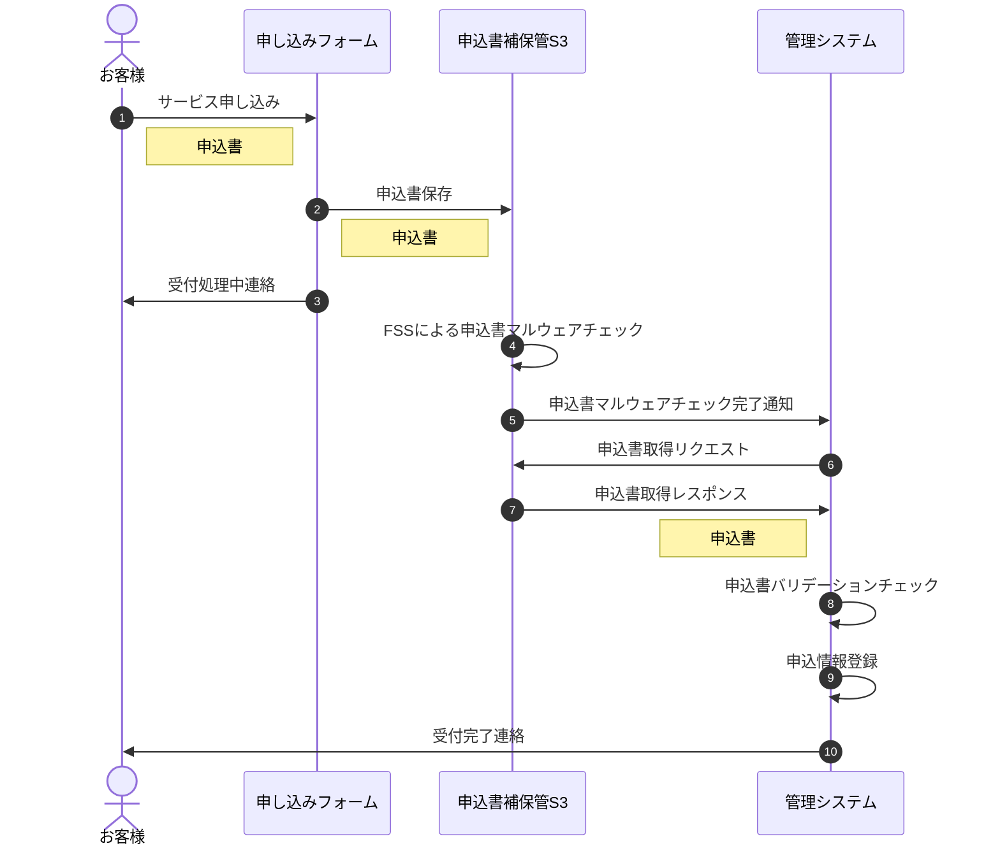

# mermaid.js

参考: https://qiita.com/caesar_cat/items/e8a116a585863633d15a#%E3%82%B5%E3%83%B3%E3%83%97%E3%83%AB

# swagger

参考:
https://qiita.com/ymd_a/items/49a5fffb6ada813f1ac5
https://dev.classmethod.jp/articles/swagger-api-docs-cloudformation-template/

# vscode shift + option + p

openapi: "3.0.0"

info: #API のメタデータ
title: "API の名称(必須)"
description: |
#API の簡潔な説明 - Get 説明 - Post 説明
termsOfService: "https://tastylog.com/terms/" #API の利用規約の URL
contact: #コンタクト情報。(サポートページの URL やメールアドレス等)
name: "Customer Support"
url: "https://test.com/support/"
email: "support-desk@tastylog.com"
license: #ライセンス情報
name: "MIT License"
url: "https://opensource.org/licenses/MIT"
version: "1.0.0" #API ドキュメントのバージョン(必須)

servers: #API を提供するサーバ

-   url: "http://localhost:{port}" #API サーバーの URL
    description: "API サーバーの説明 1"
    variables:
    port:
    description: "値の説明"
    enum: ["3000", "8080"] #利用できる値
    default: "3000"
-   url: "http://localhost/{version}" #API サーバーの URL
    description: "API サーバーの説明 2"
    variables:
    version:
    description: "値の説明"
    enum: ["1.0", "2.0"] #利用できるバージョン
    default: "1.0"
-   url: "https://api.test.com/v1"
    description: "API Test"

tags: #API で使用されるタグのリスト。各種ツールによってパースされる際は、記述された順序で出力される。タグ名はユニークで無ければならない。

-   name: "reviews" #タグの名前
    description: "タグの説明"

paths: #API で利用可能なエンドポイントやメソッド
"/shops/{shopId}/reviews": #各エンドポイントのパス。servers で定義した URL にこのパスを結合したものが最終的なエンドポイントとなる
get:
summary: "エンドポイントの説明"
description: "エンドポイントの簡潔な説明"
tags: ["reviews"]
parameters: - name: shopId #リクエストパラメータ
description: "パラメータの説明"
in: path #パラメータの場所 query header path cookie のどれか。
required: true #必須パラメータなら true
schema: { type: string } #パラメータの型
example: "渡せるパラメータの例"
responses:
"200": #ステータスコード
description: "Success operation レスポンスの説明"
content: #レスポンスボディ
application/json: #メディアタイプ
schema: #データの定義
type: array
items:
$ref: "#/components/schemas/Review"
security: []
post:
summary: "Create new review"
description: "Create specified shop's new review"
tags: ["reviews"]
parameters: - name: shopId
in: path
description: "Shop identifier"
required: true
schema: { type: string }
requestBody: #リクエストボディ
description: "リクエストボディの説明"
required: true #リクエストボディが必須なる true
content: #リクエストボディの中身
application/json: #メディアタイプ
schema: # type: string #データの型 書き方 1 # type: object #データの型 書き方 2 # properties: #object の場合 # score: { type: integer } # comment: { type: string }
$ref: "#/components/schemas/Review" #変数の利用 書き方 3
responses:
"201": #成功
description: "Success operation"
headers:
location: #位置
description: "ロケーションのデータの説明"
schema: { type: string, format: url }
"400": #エラー
$ref: "#/components/responses/400-BadRequest"
security: #API 全体を通して使用可能なセキュリティ仕様

-   apikey_auth: []
    components: #API で使用するオブジェクトスキーマ
    schemas:
    Review: #コンポーネントの位置を表す
    type: object
    properties:
    score: { type: integer }
    comment: { type: string }
    Error:
    type: object
    properties:
    code: { type: string } #エラーコード
    type: { type: string } #エラーの型
    message: { type: string } #エラーメッセージの型
    errors: #エラーの詳細
    type: array
    items:
    type: object
    properties:
    field: { type: string }
    code: { type: string }
    responses:
    400-BadRequest:
    description: "Client side error"
    content:
    application/json: #メディアタイプ
    schema:
    $ref: "#/components/schemas/Error"
    securitySchemes:
    apikey_auth:
    description: "API Key authorization"
    type: apiKey
    name: "X-Api-Key"
    in: header
