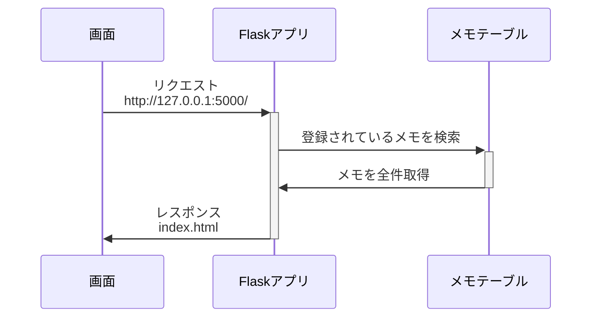

```mermaid
sequenceDiagram
    participant form as 画面
    participant app as Flaskアプリ
    participant DB as メモテーブル
    form->>+app: リクエスト<br/>http://127.0.0.1:5000/
    app->>+DB: 登録されているメモを検索
    DB->>-app: メモを全件取得
    app->>-form: レスポンス<br/>index.html
```

@
